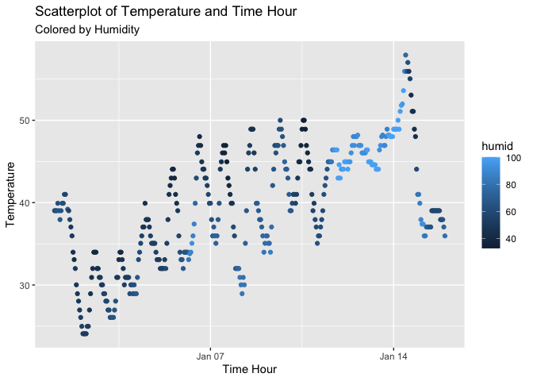

p8105_hw1_yw4199
================
Yaduo Wang
2023-09-17

\#Problem 1

``` r
library("moderndive") #Load the moderndive library.
library("tidyverse") #Load tidyverse library. 
```

``` r
data("early_january_weather") #Load the early_january_weather dataset.
view(early_january_weather) #View the early_january_weather dataset.
```

Description of the dataset: This set is a part from the weather data
frame from nycflights13. This is the hourly meterological data for LGA,
JFK and EWR in January 2013. This data contains 358 rows and 15 columns.
This dataset includes origins(character), year(integer), month(integer),
day(integer), hour(integer), temperature(numeric), dewpoint in
F(numeric), relative humidity(numeric), wind direction (in
degrees)(numeric), speed(numeric), gust speed (in mph)(numeric),
precipitation, in inches(numeric), sea level pressure in
millibars(numeric), visibility in miles(numeric), date and hour of the
recording as a POSIXct date. The mean temperature is 39.58212 in F.

``` r
?early_january_weather #accessing the dataset help file
nrow(early_january_weather) #number of rows 
```

    ## [1] 358

``` r
ncol(early_january_weather) #number of columns
```

    ## [1] 15

``` r
str(early_january_weather) #assess variable types
```

    ## tibble [358 × 15] (S3: tbl_df/tbl/data.frame)
    ##  $ origin    : chr [1:358] "EWR" "EWR" "EWR" "EWR" ...
    ##  $ year      : int [1:358] 2013 2013 2013 2013 2013 2013 2013 2013 2013 2013 ...
    ##  $ month     : int [1:358] 1 1 1 1 1 1 1 1 1 1 ...
    ##  $ day       : int [1:358] 1 1 1 1 1 1 1 1 1 1 ...
    ##  $ hour      : int [1:358] 1 2 3 4 5 6 7 8 9 10 ...
    ##  $ temp      : num [1:358] 39 39 39 39.9 39 ...
    ##  $ dewp      : num [1:358] 26.1 27 28 28 28 ...
    ##  $ humid     : num [1:358] 59.4 61.6 64.4 62.2 64.4 ...
    ##  $ wind_dir  : num [1:358] 270 250 240 250 260 240 240 250 260 260 ...
    ##  $ wind_speed: num [1:358] 10.36 8.06 11.51 12.66 12.66 ...
    ##  $ wind_gust : num [1:358] NA NA NA NA NA NA NA NA NA NA ...
    ##  $ precip    : num [1:358] 0 0 0 0 0 0 0 0 0 0 ...
    ##  $ pressure  : num [1:358] 1012 1012 1012 1012 1012 ...
    ##  $ visib     : num [1:358] 10 10 10 10 10 10 10 10 10 10 ...
    ##  $ time_hour : POSIXct[1:358], format: "2013-01-01 01:00:00" "2013-01-01 02:00:00" ...

``` r
mean(early_january_weather$temp) #the mean temperature
```

    ## [1] 39.58212

``` r
plot = ggplot(early_january_weather, mapping = aes(x = time_hour, y = temp, color = humid))+
      geom_point()+
      labs(x = "Time Hour",
            y = "Temperature",
            title = "Scatterplot of Temperature and Time Hour",
            subtitle = "Colored by Humidity"
            )
plot
```

<!-- -->

``` r
#Make a scatterplot of temp (y) vs time_hour (x); color points using the humid variable.
```

``` r
ggsave("p8105_hw1_yw4199_scatter_plot.pdf", height = 4, width = 6)
#Export your scatterplot to your project directory using ggsave.
```

Describe patterns that are apparent in this plot.

\#Problem 2

Create a data frame

``` r
normal_df = tibble(
  norm_samp = rnorm(10, mean = 1), 
  #a random sample of size 10 from a standard Normal distribution
  norm_samp_pos = norm_samp > 0,
  #a logical vector indicating whether elements of the sample are greater than 0
  vector = sample(letters, 10, replace = TRUE),
  #a character vector of length 10
  factor = as.factor(sample(1:3, 10, replace = TRUE))
  #a factor vector of length 10, with 3 different factor “levels”
)
```

Try to take the mean of each variable in your dataframe

``` r
mean(pull(normal_df, norm_samp))
```

    ## [1] 0.7504257

``` r
mean(pull(normal_df, norm_samp_pos))
```

    ## [1] 0.8

``` r
mean(pull(normal_df, vector))
```

    ## Warning in mean.default(pull(normal_df, vector)): argument is not numeric or
    ## logical: returning NA

    ## [1] NA

``` r
mean(pull(normal_df, factor))
```

    ## Warning in mean.default(pull(normal_df, factor)): argument is not numeric or
    ## logical: returning NA

    ## [1] NA

For vector and factor variables they return NA because they are neither
numeric or logical. For the first numeric variable, it returns
0.8553194; and for the second variable, since it is logical variable, it
will treat F as 0 and T as 1 and then return the mean for all the
values.

Write a code chunk that applies the as.numeric function to the logical,
character, and factor variables.

``` r
norm_samp_pos_num = as.numeric(normal_df$norm_samp_pos) #convert logical variable to numeric
vector_num = as.numeric(normal_df$vector) #convert vector to numeric
```

    ## Warning: NAs introduced by coercion

``` r
factor_num = as.numeric(normal_df$factor) #convert factor to numeric

#generate mean for all the converted variables
mean(norm_samp_pos_num) 
```

    ## [1] 0.8

``` r
mean(vector_num)
```

    ## [1] NA

``` r
mean(factor_num)
```

    ## [1] 2.4

The norm_samp_pos_num generates 1s, and it seems no meaning corresponds
to its original values, and its mean is 1 which is not meaningful. The
vector_num generates all NAs, and its mean is NA. The factor_num
generates a series of numbers corresponding to the values of their
original vector, and its mean is 2.1.
